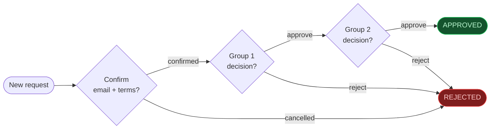
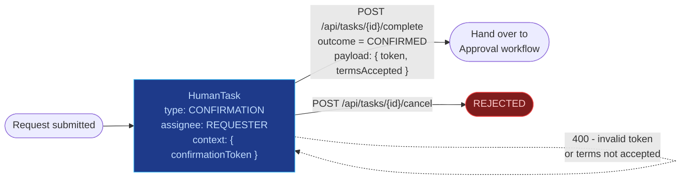
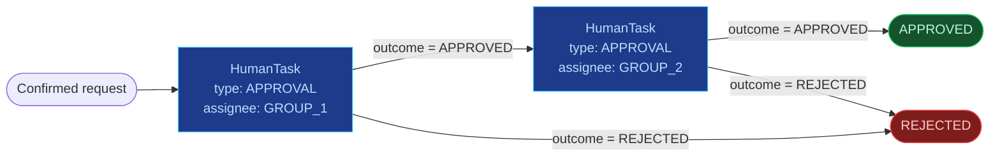
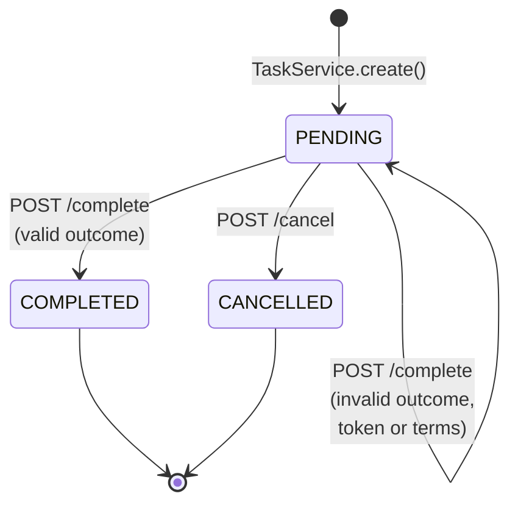
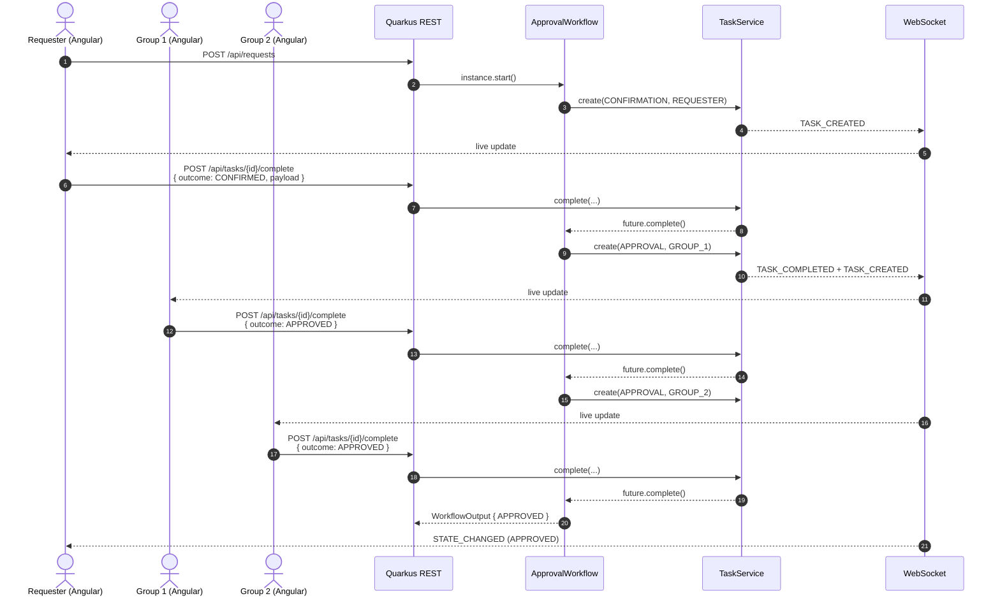

# Quarkus Flow Approval Demo

End-to-end demo of a multi-stage approval workflow:

1. **Async confirmation step** — the requester must confirm their email
   address (via a token-protected link) and explicitly accept the terms
   &amp; conditions. The workflow is *suspended* on this step until the
   click happens.
2. **Approval group 1** — the workflow is suspended until group 1 decides.
3. **Approval group 2** — only entered if group 1 approved; the workflow is
   suspended until group 2 decides.
4. **Terminal** — `APPROVED` if both groups approved, otherwise `REJECTED`.

### End-to-end flow



The demo is structured as **two cooperating sub-workflows**, both
implemented as wait tasks of the same `ApprovalWorkflow`:

1. The **Request workflow** — creates a `CONFIRMATION` task for the
   requester and suspends until the requester either confirms email
   ownership and accepts the terms, or cancels the request.
2. The **Approval workflow** — runs only if confirmation succeeded;
   creates two sequential `APPROVAL` tasks (group 1 first, group 2 only
   if group 1 approved).

#### Request workflow (async email / terms confirmation)



#### Approval workflow (two sequential approval groups)



#### Task lifecycle

Every async step in either sub-workflow is mediated by the same generic
`HumanTask` state machine — that is exactly what makes the REST surface
type-agnostic.



#### Happy-path interaction (REST + WebSocket)



## Stack

| Layer    | Tech                                                              |
| -------- | ----------------------------------------------------------------- |
| Workflow | [Quarkus Flow](https://docs.quarkiverse.io/quarkus-flow/dev/) 0.9.0 (CNCF Serverless Workflow DSL 1.0.0) via `io.quarkiverse.flow:quarkus-flow`, on top of `io.serverlessworkflow` 7.21 |
| Backend  | Quarkus 3.33 on Java 25 (REST + WebSocket)                         |
| Frontend | Angular 21 — zoneless, standalone components, TypeScript 5.9      |
| Transport | REST (commands) + WebSocket (live state events to the UI)         |
| Testing  | JUnit 5 + RestAssured (backend), Vitest + jsdom (frontend)         |
| CI / CD  | GitHub Actions (build, test, e2e, CodeQL, dependency-review) + Dependabot (Maven, npm, GitHub Actions) |

The workflow is defined in two equivalent ways:
* **Runtime source of truth:** Java DSL in
  [`ApprovalWorkflow.java`](backend/src/main/java/com/example/approval/ApprovalWorkflow.java)
  using `FuncWorkflowBuilder` from Serverless Workflow Java SDK.
* **Declarative reference:** [`approval.yaml`](backend/src/main/flow/approval.yaml)
  in the standard `src/main/flow` location.

Asynchronous wait tasks block on per-request `CompletableFuture`s held in
`ApprovalService`; the matching REST endpoints complete those futures so
the workflow resumes.

## Tooling

Tool versions are pinned with [mise](https://mise.jdx.dev) and orchestrated
with [task](https://taskfile.dev):

```bash
# one-time, installs Java 25, Maven, Node 22, Task into the project shell
mise install

# show all available tasks
task --list
```

`mise.toml` pins the language versions; `Taskfile.yml` exposes the
day-to-day commands.

## Run

```bash
task install     # frontend npm install + warm Maven cache
task dev         # backend (8080) + frontend (4200) in parallel
```

Or run them individually:

```bash
task dev:backend         # quarkus:dev, live reload at http://localhost:8080
task dev:frontend        # ng serve at http://localhost:4200
```

### Without task

```bash
cd backend && mvn quarkus:dev
# in another shell:
cd frontend && npm install && npm start
```

REST surface — **generic, task-based**. Each async step in the workflow
emits a `HumanTask`; clients drive the workflow forward by completing or
cancelling tasks. No new REST routes are needed when stages are added.

| Method | Path                                | Purpose                                                |
| ------ | ----------------------------------- | ------------------------------------------------------ |
| POST   | `/api/requests`                     | Create request, starts workflow instance               |
| GET    | `/api/requests`                     | List all requests (with embedded tasks + history)      |
| GET    | `/api/requests/{id}`                | Get a single request                                   |
| GET    | `/api/tasks?status=&group=&requestId=` | List tasks (with optional filters)                  |
| GET    | `/api/tasks/{id}`                   | Get a single task                                      |
| POST   | `/api/tasks/{id}/complete`          | Complete a task: `{ actor, outcome, payload }`         |
| POST   | `/api/tasks/{id}/cancel`            | Cancel a pending task: `{ actor, reason }`             |
| WS     | `/approval-events`                  | Server-pushed request- and task-lifecycle events       |

Task types currently emitted by `ApprovalWorkflow`:

| Type           | Assignee   | Valid outcomes        | Payload                          |
| -------------- | ---------- | --------------------- | -------------------------------- |
| `CONFIRMATION` | `REQUESTER`| `CONFIRMED`, `CANCELLED` | `{ token, termsAccepted }` |
| `APPROVAL`     | `GROUP_1`, `GROUP_2` | `APPROVED`, `REJECTED` | optional `{ reason }` |

### Frontend

```bash
cd frontend
npm install
npm start               # http://localhost:4200
```

CORS is pre-configured for `http://localhost:4200`.

## Try it end-to-end

1. Open <http://localhost:4200>.
2. Fill in the form (requester + email + subject), tick the terms checkbox,
   click **Submit request**.
3. The detail page opens with the request in **Awaiting confirmation**. A
   simulated email is shown with a Confirm button.
4. Tick the terms checkbox in the email panel and click **Confirm**.
   The workflow advances to **Awaiting Group 1**.
5. Enter an approver name and click **Approve**. The flow advances to **Group 2**.
6. Approve again from Group 2 — the request reaches **Approved**.

All transitions are pushed to the UI in real time via WebSocket; the SVG
flow diagram highlights the current state.

## Tests

```bash
task test           # backend + frontend
task test:backend   # Quarkus / JUnit5 / RestAssured
task test:frontend  # Angular / Karma / Jasmine (headless Chrome)
task e2e            # curl-based smoke test against a running stack
```

* **Backend** — `ApprovalFlowTest` exercises the full workflow through
  REST: happy path (submit → confirm → group1 approve → group2 approve →
  APPROVED) plus rejection paths at every async step, invalid input,
  wrong token and missing terms acceptance.
* **Frontend** — `approval.model.spec.ts` and `approval.service.spec.ts`
  cover the state-helper functions and the HTTP service contracts using
  Angular's `HttpTestingController`. Tests run under [Vitest](https://vitest.dev)
  in a jsdom environment via the Angular 21 `@angular/build:unit-test`
  builder — no browser or Karma required.
* **End-to-end** — `scripts/e2e-smoke.sh` drives the running stack from
  the outside via `curl` and verifies the terminal state.

## CI / CD

GitHub Actions workflows live in [`.github/workflows`](.github/workflows):

| Workflow                | Trigger                          | What it does                                                                                  |
| ----------------------- | -------------------------------- | --------------------------------------------------------------------------------------------- |
| `ci.yml`                | push & PR to `main`, manual      | `backend` Maven build + JUnit5; `frontend` `ng build` + Karma; `e2e` smoke against the runner JAR; aggregated `ci-success` gate. |
| `codeql.yml`            | push & PR to `main`, weekly cron | CodeQL static analysis for `java-kotlin` (Maven manual build) and `javascript-typescript`.    |
| `dependency-review.yml` | PR to `main`                     | `actions/dependency-review-action`, fails on `high` severity advisories.                      |

Dependency updates are managed by [Dependabot](.github/dependabot.yml) — weekly
PRs (Mon 06:00 Europe/Berlin) for three ecosystems:

* `maven` (`/backend`) — grouped: Quarkus, Quarkiverse, Serverlessworkflow,
  Maven plugins, test deps.
* `npm` (`/frontend`) — grouped: Angular, Karma/Jasmine, TypeScript.
* `github-actions` (`/`) — all actions in one group.

In-progress runs are auto-cancelled for the same ref via `concurrency`, and
each job uploads its artifacts (Surefire reports, runner JAR, frontend
`dist`, e2e Quarkus log) for post-mortem.
